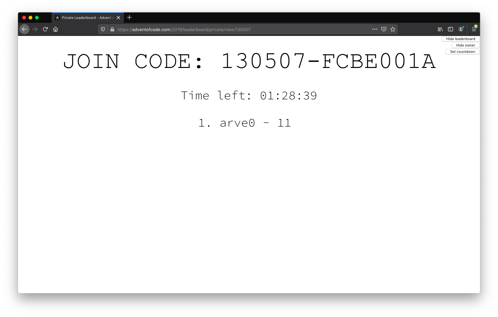

## Develop
```sh
npm run dev:ext
```

Then
1. log in
2. navigate to https://adventofcode.com/leaderboard/private
3. click [View]
4. edit [App.svelte](src/App.svelte)
5. `npm run build`
6. browser should automaticly update
